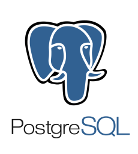

# Tips & Tricks

Quelques trucs et astuces sur certains langages, outils, ...

[](http://forthebadge.com) [](http://forthebadge.com)  [](http://forthebadge.com)  [](http://forthebadge.com)


## IBM DB2


### Scripts utiles

* [Rechercher une colonne dans la base de données](./scripts/db2/column-search.sql)
* [Obtenir une ordre SQL de CREATE TABLE d'une table](./scripts/db2/create-table-from-db2-structure.sql)
* [Compter le nombre de colonnes](./scripts/db2/count-columns-per-table.sql) par table

## Microsoft SQL Server


### Scripts utiles

#### Sécurité

* [Find TCP port](./scripts/security/find-tcp-port.sql)
* [List of SQL Server users who can connect](./scripts/security/list-of-sqlserver-users-who-can-connect.sql)
* [List of Active Directory users who can connect](./scripts/security/list-of-ad-users-who-can-connect.sql)
* [Changing the current password](./scripts/security/changing-the-current-password.sql)
* [Restore password](./scripts/security/restore-password.sql)
* [Generate permissions](./scripts/security/generate-permissions.sql)
* [Permissions on objects and object owners](./scripts/security/permissions-on-objects-and-object-owners.sql)

#### Indexes

* [Deletion of hypothetical indexes](./scripts/indexes/deletion-of-hypothetical-indexes.sql)
* [Find duplicate indexes](./scripts/indexes/find-duplicate-indexes.sql)
* [Rebuild indexes](./scripts/indexes/rebuild-indexes.sql)
* [Useless indexes](./scripts/indexes/useless-indexes.sql)
* [Missing indexes #1](./scripts/indexes/missing-indexes-1.sql)
* [Missing indexes #2](./scripts/indexes/missing-indexes-2.sql)

#### Primary Key / Foreign Key / Constraints

* [Drop & Create of all existing constraints](./scripts/pk_fk_constraints/drop-create-of-all-existing-constraints.sql)
* [Drop all FK from DB](./scripts/pk_fk_constraints/drop-all-fk-from-db.sql)
* [Find tables that do not have foreign keys](./scripts/pk_fk_constraints/find-tables-that-do-not-have-foreign-keys.sql)
* [List all the dependencies of the database](./scripts/pk_fk_constraints/list-all-the-dependencies-of-the-database.sql)
* [Orphan tables (without referential integrity constraints)](./scripts/pk_fk_constraints/orphan-tables.sql)
* [Tables containing ID columns with no foreign key](./scripts/pk_fk_constraints/tables-containing-id-columns-with-no-foreign-key.sql)
* [Tables with constraints, default values, rules, triggers, ... and how many](./scripts/pk_fk_constraints/tables-with-constraints-default-values-rules-triggers-and-how-many.sql)
* [Tables without a primary key](./scripts/pk_fk_constraints/tables-without-primary-key.sql)
* [Tables without clustered index (and without any index at all)](./scripts/pk_fk_constraints/tables-without-clustered-index.sql)
* [Top 10 most indexed tables](./scripts/pk_fk_constraints/top-10-most-indexed-tables.sql)
* [Find tables with foreign keys](./scripts/pk_fk_constraints/find-tables-with-fk.sql)

#### Triggers

* [Find the triggers positioned on the tables](./scripts/triggers/find-all-triggers.sql)

#### Cycle de vie de la donnée

* [Delete historical data from a table according to its dependencies](./scripts/data_lifecycle/delete-historical-data-from-a-table-according-to-its-dependencies.sql)
* [A summary of the structure of the tables](./scripts/data_lifecycle/summary-of-tables-structures.sql)
* [Gets the content of each column in a specified table](./scripts/data_lifecycle/get-content-of-each-column-in-a-specified-table.sql)
* [Max data length](./scripts/data_lifecycle/max-data-length.sql)
* [Number of tables per schema](./scripts/data_lifecycle/number-of-tables-per-schema.sql)
* [Tables that have no documentation in the extended properties](./scripts/data_lifecycle/tables-without-documentation-in-extended-properties.sql)
* [Using a column in a database](./scripts/data_lifecycle/using-a-column-in-a-database.sql)
* [Impact analysis](./scripts/data_lifecycle/impact-analysis.sql)
* [Batch delete](./scripts/data_lifecycle/batch-delete.sql)

#### Procédures stockées

* [Execute instructions stored in database](./scripts/stored_procedures/execute-instructions-stored-in-database.sql)
* [Retrieve all stored procedures](./scripts/stored_procedures/retrieve-all-stored-procedures.sql)

#### BCP

* [Generate the bcp instruction for a table](./scripts/bcp/generate-bcp-instruction-for-a-table.sql)
* [Generate the bcp instruction from all the tables in the database](./scripts/bcp/generate-bcp-instruction-for-all-the-tables-in-db.sql)

#### Vues

* [Retrieve the composition of a view](./scripts/view/view-composition.sql)

#### Audit

* [Returns the available space of the server](./scripts/audit/available-space.sql)
* [Returns the date of the last backup performed](./scripts/audit/last-backup-date.sql)
* [Memory usage check](./scripts/audit/memory-usage-check.sql)
* [Number of rows and spaces (allocated, used, unused) of tables](./scripts/audit/number-rows-and-table-space.sql)
* [Retrieve system information from the RDBMS](./scripts/audit/rdbms-system-informations.sql)
* [SQL Server 2012 Diagnostic Information Queries](./scripts/audit/sqlserver-2012-diagnostic-information.sql)
* [Compute statistics](./scripts/audit/compute-statistics.sql)
* [Detailed index fragmentation](./scripts/audit/detailed-index-fragmentation.sql)
* [Limited index fragmentation](./scripts/audit/limited-index-fragmentation.sql)
* [Volumetry](./scripts/audit/volumetry.sql)
* [The latest modifications made to the database](./scripts/audit/latest-modification-made.sql)
* [Top 20 longest queries](./scripts/audit/top-20-longest-queries.sql)
* [Get the optimal set of columns that compose PK](./scripts/audit/optimal-set-of-columns.sql)
* [Job status](./scripts/audit/job-status.sql)
* [One stop view of tables structure](./scripts/audit/one-stop-view-of-tables-structure.sql)
* [Get each object of tables](./scripts/audit/)

### Liens utiles

* [Cycles Adventure Works](https://docs.microsoft.com/fr-fr/previous-versions/sql/sql-server-2008/ms124825(v=sql.100)?redirectedfrom=MSDN) - MS SQL Server DB sample
* [Adventure Works](https://docs.microsoft.com/fr-fr/previous-versions/sql/sql-server-2008/ms124501(v=sql.100)?redirectedfrom=MSDN) - MS SQL Server DB sample
* [SQL Authority](https://blog.sqlauthority.com/) - One of my references in SQL
* [SQL Server Maintenance Solution](https://ola.hallengren.com/) - SQL Server Backup, Integrity Check, and Index and Statistics Maintenance made by [Ola Hallengren](https://github.com/olahallengren)

### Dépôts utiles

* [Ola Hallengren](https://github.com/olahallengren)

## PostgreSQL



### Scripts utiles

#### Audit

* [Obtient les statistiques de contenu d'une table](./scripts/postgresql/audit/table-statistics.sql)
* [Vérifier le fillfactor pour chaque tables et index de la base de données](./scripts/postgresql/audit/fill-factor-value.sql)
* [Trouver les index en doublon](./scripts/postgresql/audit/duplicate-indexes.sql)
* [Trouver les index inutiles](./scripts/postgresql/audit/useless-indexes.sql)
* [Obtenir la structure de la table](./scripts/postgresql/audit/table-structure.sql)
* [Obtenir les statistiques d'utilisation](./scripts/postgresql/audit/index-usage-statistics.sql)
* [Les tables sur lesquelles il manque un index](./scripts/postgresql/audit/tables-need-indexing.sql)
* [Retourner les tables sur lesquelles il manque une clé primaire ou une clé unique](./scripts/postgresql/audit/tables-without-pk-ui.sql)
* [Retourner les tables sur lesquelles il manque une clé primaire](./scripts/postgresql/audit/tables-without-pk.sql)
* [Retourner les tables avec des champs de type Geometry non indexés](./scripts/postgresql/audit/tables-without-indexes-on-geometry.sql)
* [Trouver les tables avec le plus de fragmentation](./scripts/postgresql/audit/find_bloated_tables.sql)
* [Trouver les index manquants](./scripts/postgresql/audit/missing-indexes.sql)
* [Rechercher une valeur dans les colonnes d'une table](./scripts/postgresql/audit/search-in-every-field-in-a-table.sql)

#### Taille

* [Vérifier la taille de la base de données](./scripts/postgresql/size-related-issues/db-size.sql)
* [Obtenir le nombre de bits gaspillés](./scripts/postgresql/size-related-issues/wasted-bytes.sql)
* [Quelle table a le plus de dead tuples](./scripts/postgresql/size-related-issues/dead-tuples.sql)
* [Quelle table ou index consomme le plus d'espace](./scripts/postgresql/size-related-issues/most-space.sql)

#### Performance

* [Top 10 des requêtes les plus longues](./scripts/postgresql/performance-related-issues/top-10-longest-queries.sql)
* [Obtenir les requêtes en cours d'exécution et les statuts de verrouillage](./scripts/postgresql/performance-related-issues/running-queries.sql)
* [Tuer une requête](./scripts/postgresql/performance-related-issues/kill.sql)

#### Securité

* [Retourne les autorisations par utilisateur](./scripts/postgresql/security/user-grants.sql)

### Liens utiles

* [PostgreSQL SQL Tricks](https://postgres.cz/wiki/PostgreSQL_SQL_Tricks) - Tips & Tricks
* [PostgreSQL Index Maintenance](https://wiki.postgresql.org/wiki/Index_Maintenance) - Maintenance des index
* [Postgres Cheat Sheet](https://postgrescheatsheet.com/#/tables) - PGSQL cheat sheet
* [PGSQL commands & queries](https://dzone.com/articles/useful-postgresql-commandsqueries-part-1) - Commandes et requêtes utiles

## Elastic


### Liens utiles

* [Kibana best practices](https://www.elastic.co/guide/en/kibana/master/development-best-practices.html) - Les bonnes pratiques d'Elastic

## Qlik Sense


### Documents utiles

* [Qlik Sense template](./qvf/template.qvf) - Un modèle de document Qlik Sense

### Liens utiles

* [Qlik Sense Demo](https://demos.qlik.com/qliksense) - Exemples de réalisations avec Qlik Sense

### Outils utiles

* [SenseTheme](https://sensetheme.com/) - Un générateur de thèmes pour Qlik Sense

## Qlikview


### Documents utiles

* [DocumentAnalyzer_V1.14](./qvw/DocumentAnalyzer_V1.14.qvw) - Ce document peut analyser les champs utilisées dans un autre document QVW 
* [QvsEditor_v1.2](./qvw/QvsEditor_v1.2.qvw) - Ce document peut éditer les fichiers QVS (Qlikview scripts)
* [QVD Dictionary V2](./qvw/QVD_Dictionary_V2.qvw) - Ce document peut scanner les fichiers QVD/QVW pour construire un dictionnaire de données
* [Human Resources](./qvw/Human_Resources.qvw) - Un exemple de tableau de bord
* [Master Calendar](./qvw/qlik-calendar.qvw) - Construire un calendrier maître avec Qlikview
* [CSV to QVD generator](./qvw/convert_csv_to_qvd.qvw) - Convertir des fichiers CSV au format QVD
* [External Expressions](./qvw/external_expressions.qvw) - Externaliser les expressions
* [Central KPI formula repository](./qvw/kpi_formula_generator.qvw)
* [SQL to QVD generator](./qvw/qvd_generator.qvw) - Convertir des tables au format QVD

### Liens utiles

* [Qlikview Cookbook](https://qlikviewcookbook.com/) - Plusieurs recettes sur Qlik
* [Living QlikView](http://livingqlikview.com/19-tips-all-qlikview-beginners-must-know/) - Trucs et astuces que tout débutant devrait connaitre
* [Central KPI formula repository](https://community.qlik.com/t5/Deployment-Framework/Central-KPI-Formula-Repository-solution/td-p/1478681)
* [QlikView Demo](https://demos.qlik.com/qlikview) - Exemples de réalisation avec QlikView
* [Living Qlik](http://livingqlikview.com/) - A blog about Qlik
* [QuickIntelligence](https://www.quickintelligence.co.uk/examples/) - Exemples de réalisation avec QlikView
* [IPPON Qlikview Blog](https://blog.ipponservices.com/) - Un blog sur QlikView
* [Qlik Blog](http://www.qlikblog.at/) - Un autre blog sur QlikView
* [World Football Fan App](https://eu-b.demo.qlik.com/QvAJAXZfc/opendoc.htm?document=qvdocs/Choose%20Your%20Champion.qvw&sourceID1=mkto-2014-H1-World-Football)

### Outils utiles

* [EasyQlik QViewer](https://www.easyqlik.com/) - Un Viewer de QVD
* [Set Analysis Wizard for QlikView](http://tools.qlikblog.at/SetAnalysisWizard/QlikView-SetAnalysis_Wizard_and_Generator.aspx?sa=) - Un assistant pour les SetAnalysis
* [Nested If Generator](http://www.qlikblog.at/tools/Nested-If-Generator.html) - Un assistant pour les If imbriqués

### Scripts utiles

* Build a calendar
* Play with mapping
* Reset an inputfield

### Macros utiles

* Add conditionnal expression to chart
* Set up autozoom
* Change layout 
* Clone a dimension group
* Delete a file
* Dynamic Update
* Export object from hidden sheet to jpg
* Export object to Excel
* Export object to jpg
* Import/Export all variables
* Open a document with current month selection
* Open/Reload/Click/Close
* Read & write a variable
* Run an external program
* Save & exit Qlikview
* Send mail

## SQL


### Liens utiles

* [SQLPro](https://sqlpro.developpez.com/) - Une bible en français sur le SQL
* [SQLPro Forum](https://www.developpez.net/forums/u3170/sqlpro/) - Un forum bien utile sur SQL
* [SqLines](http://www.sqlines.com/online) - Convertir une instruction SQL d'un SGBDR vers un autre SGBDR (Oracle vers SQL Server, SQL Server vers PostgreSQL, ...)
* [DBMS Tools](https://dbmstools.com/) - Une liste des outils autour des bases de données

### Outils utiles

* [FlyWay](https://flywaydb.org/) - Un outil open-source de maintien de base de données, avec des scripts de migration, des scripts rejouables, des scripts d'annulation ...

## Neo4j


### Scripts utiles

* [Data dictionnary (tables)](./scripts/data-dictionnary-tables.sql)
* [Data dictionnary (relations)](./scripts/data-dictionnary-relations.sql)
* [Build nodes & edges](./scripts/build-nodes-and-edges.sql)
* [Delete existing nodes & edges](./scripts/delete-existing-nodes-edges.sql)
* [Rebuild all nodes & edges](./scripts/rebuild-all-nodes-and-edges.sql)

### Liens utiles

* [Neo4j Blog](https://neo4j.com/blog/) - A blog about Neo4j ;)
* [Graph visualization](https://neo4j.com/blog/graph-visualization-neo4j-schemas-yfiles/)
* [Data Integration](https://neo4j.com/data-integration/)
* [Synbioz Blog](https://www.synbioz.com/blog/tech/introduction-graph-db) - An introduction to graph-db
* [ETL](https://neo4j.com/developer/neo4j-etl/)

## Oracle Data Integrator


### Scripts utiles

* [Retrieve the last session per scenario](./scripts/retrieve-last-session-per-scenario.sql)
* [Analyze the KM used in the interfaces](./scripts/analyze-km.sql)
* [Check the properties of the table columns](./scripts/check-properties-of-columns.sql)
* [Compare the last modification dates of the objects](./scripts/compare-last-modification-date.sql)
* [Data lineage](./scripts/data-lineage.sql)
* [Key and check not null option on target columns](./scripts/key-and-cnn-option-on-target-columns.sql)
* [List of models, sub-models and tables with the corresponding parent folders and last userdate details](./scripts/list-models.sql)
* [Retrieve the list of interfaces in ODI](./scripts/retrieve-interfaces.sql)
* [Retrieve the list of scenarios in ODI](./scripts/retrieve-scenarios.sql)
* [Retrieve the list of tables in ODI](./scripts/retrieve-tables.sql)
* [Show the actual target mappings of the interfaces](./scripts/show-actual-target-mappings.sql)
* [Introspection](./scripts/introspection.sql)

### Liens utiles

* [Help Center Oracle Data Integrator](https://docs.oracle.com/en/middleware/fusion-middleware/data-integrator/index.html)
* [A blog about ODI](https://www.clearpeaks.com/?s=odi)

## Système & Réseau


### Scripts utiles

* [Obtenir la clé Wifi](./scripts/system/netsh_wlan_show_profile.bat) d'un SID

```bat
netsh wlan show profile name=SID key=clear
```

## Réalisé avec

* [Git](https://git-scm.com)

## Contributions

Si vous souhaitez contribuer, lisez le fichier CONTRIBUTING.md pour savoir comment procéder.
